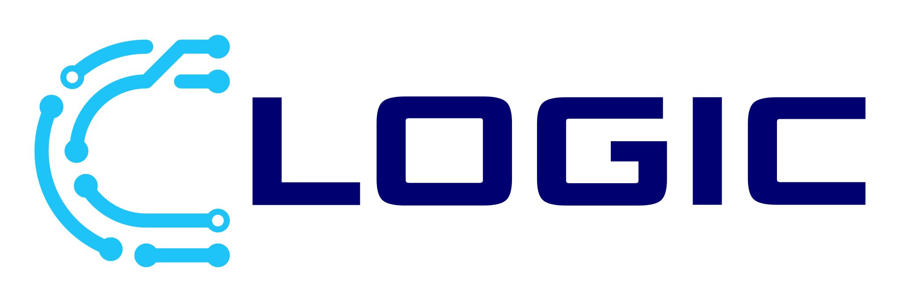

## Founder & Systems Architect at CLogic

I’ve been building in Unity since 2017, mainly on systems, tooling and designing architecture that doesn’t collapse six months later.
I prefer working close to foundations to ensure that projects can scale

My work is about shared systems, workflow discipline, and bringing structure to projects that need stability.

### 🔭 Currently Working On
- Maintaining CLogic’s core Unity libraries and internal tools
- Integrating core systems into active projects and reviewing architecture

### 🧱 Scope of Work
- Design and maintain reusable Unity systems used across multiple projects
- Review architecture and refine workflows to prevent long-term maintenance issues
- Catch architectural issues early and correct workflows.

## 🛠️ Tech Stack

### Tools & Frameworks

 

### Interests

 

## 📬 Reach Out

**Email**: shaun@clogic.dev

# "He who thinks he can, and he who thinks he cannot are both correct"

